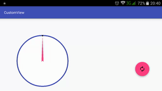

# custom-view

## Introduction :point_up:

Building on the lessons learnt making a simple custom view (as seen in the master branch), a wind direction and speed custom view appears. :

## How It Works

The code here draws a compass-like figure with an arrow pointing toward the wind direction. On the right of the compass is text showing the wind speed. A video is here. :down:

 

## Abilities :muscle:

* The custom view can show both wind direction and speed - indeed any direction and speed combo. 
* Animation! :smile:

## Limitations :worried:

* It does not use its space well. Layout margins show this. Not good.
* The wind speed text cannot be styled.
* The compass border and arrow thicknesses are rather huge.
* The north indicator is a text as opposed to a visual cue as seen in many compasses.
* One can think that the compass is a speedometer showing a graphical representation of the wind speed.

## Possible Future Work :fast_forward:

- [ ] Make spacing more efficient.

- [ ] Put a TextView in the view so that we can style the speed text.

- [ ] Change the compass arrow and border thicknesses.

## Other things :books:

I'd like to thank Envato Tutsplus for their tutorials. Very simple. Very direct. :clap:

Some references that made this code possible are:

* http://www.programcreek.com/java-api-examples/index.php?source_dir=andbase-master/AndBase/src/com/ab/util/AbGraphicUtil.java, which showed me the [TextPaint] class, which I used to determine the length of the speed text.

* http://stackoverflow.com/questions/6763231/draw-rotated-path-at-particular-point, which told me how to rotate the [Path] that defines the compass arrow.

* http://android-er.blogspot.co.ke/2014/06/rotate-path-with-matrix.html, which told me how to reset the [Matrix] that defines the rotation of the compass arrow.

## License :lock_with_ink_pen:

This repository is licensed under the [GNU General Public License Version 3](http://www.gnu.org/licenses/gpl-3.0.en.html).
