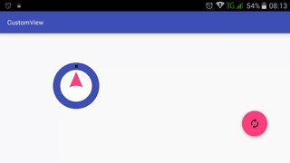

# custom-view

## Introduction :point_up:

A simple app to show how to make a simple custom View in Android. The app is based on [this](http://code.tutsplus.com/tutorials/android-sdk-creating-custom-views--mobile-14548) tutorial kindly provided by [Envato Tutsplus](http://tutsplus.com/). 

## How It Works

The code here simply draws a circle with "Hello World" in it. There also is a button that makes the circle color, text color, and text change. Below is a video to illustrate the results.

 

## Other things :books:

I'd like to thank Envato Tutsplus for their tutorials. Very simple. Very direct. :clap:

## License :lock_with_ink_pen:

This repository is licensed under the [GNU General Public License Version 3](http://www.gnu.org/licenses/gpl-3.0.en.html).
